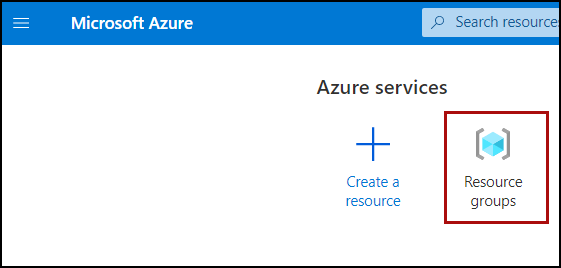
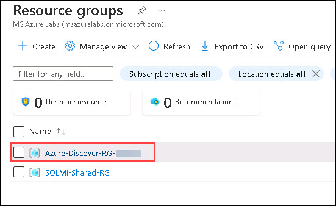
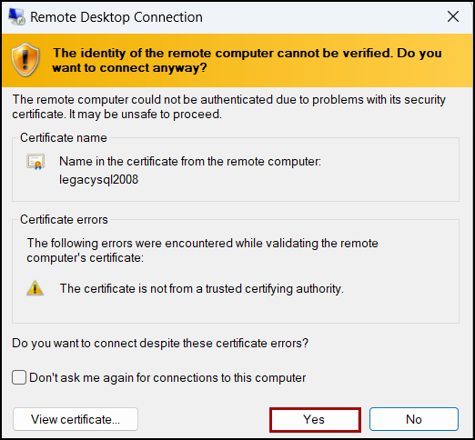
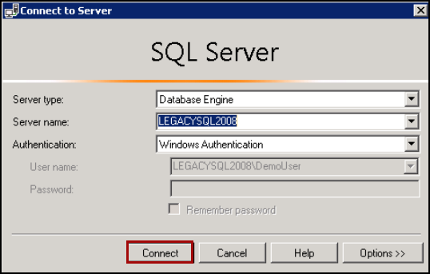
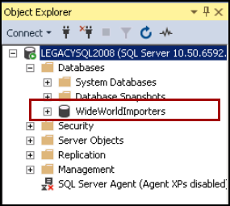
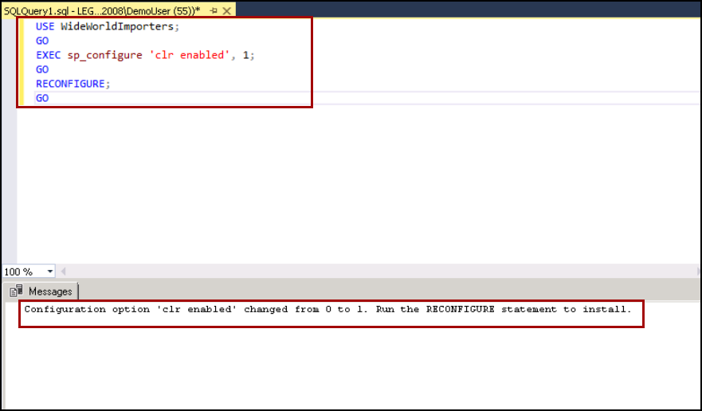

## Exercise 1: Review and enable CLR on legacy server

### Task 1: Connect to the WideWorldImporters database on the legancysql2008 VM

1. Navigate to the [Azure portal](https://portal.azure.com) and select **Resource groups** from the Azure services list.

   

1. Select the **Azure-Discover-RG-<inject key="DeploymentID" enableCopy="false" />** resource group from the list.

   

1. In the list of resources for your resource group, select the **legacysql2008** VM.

   

1. On the **legacysql2008** VM blade in the Azure portal, select **Overview** from the left-hand menu, and then select **Connect** and **RDP** on the top menu, as you've done previously.

   

1. On the Connect with RDP blade, select **Download RDP File**, then open the downloaded RDP file.

1. Select **Connect** on the Remote Desktop Connection dialog.

   

1. Enter the following credentials when prompted, and then select **OK**:

   - **Username**: `DemoUser`
   - **Password**: `Password.1234567890`

   

1. Select **Yes** to connect if prompted that the remote computer's identity cannot be verified.

   
 
 
### Task 2: Connect to the SSMS.
 
1. Once logged in, open **Microsoft SQL Server Management Studio 17** (SSMS) by entering "sql server" into the search bar in the Windows Start menu and selecting **Microsoft SQL Server Management Studio 17** from the search results.

   

1. In the SSMS **Connect to Server** dialog, enter LEGACYSQL2008 into the Server name box, ensure **Windows Authentication** is selected, and then select **Connect**.
  
    

1. Once connected, verify you see the `WideWorldImporters` database listed under databases.

    
 

### Task 3: Enable CLR on legacy server.
 
1. In Microsoft SQL Server Management Studio, select **New Query** from the SSMS toolbar.

    
    
1. Next, copy and paste the SQL script below into the new query window. This script enables the Common Language Runtime in databases.

    ```sql
    USE WideWorldImporters;
    GO
    EXEC sp_configure 'clr enabled', 1;
    GO
    RECONFIGURE;
    GO
    ```

   >**Note:** Replace [database_name] with the name of the database in which you want to enable CLR.

1. To run the script, select **Execute** from the SSMS toolbar.

    

1. The output will look like below

   
