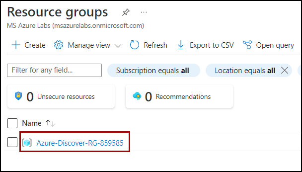
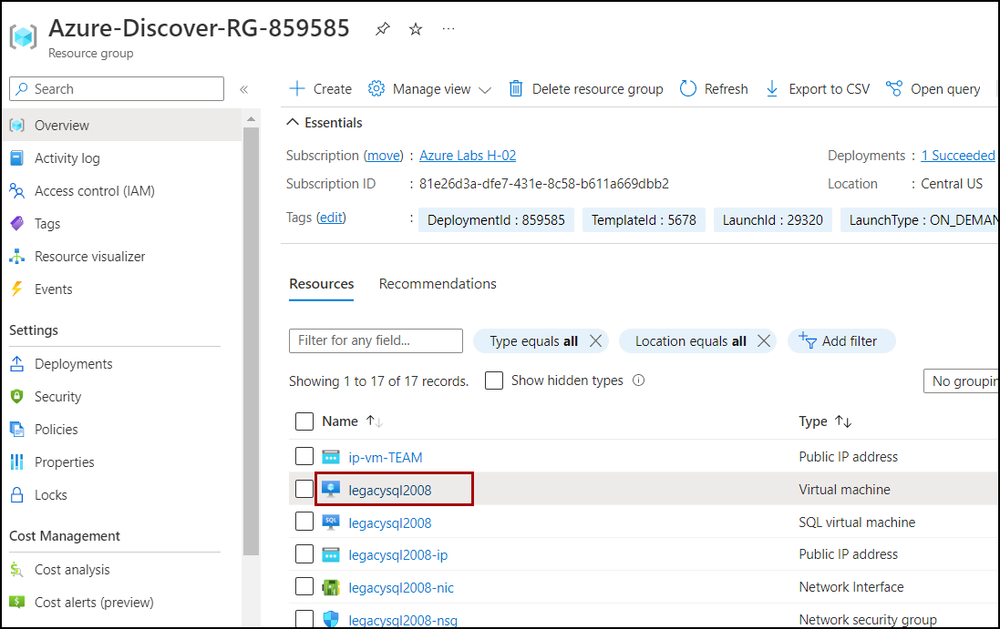
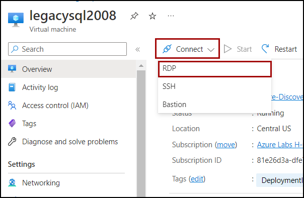
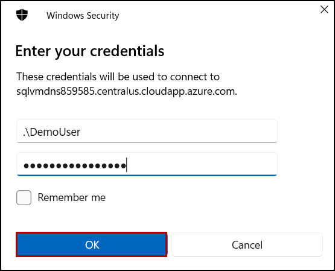

## Exercise 1: Check legacy server

### Task 1: Restore Databases

1. Navigate to the [Azure portal](https://portal.azure.com) and select **Resource groups** from the Azure services list.

   

1. Select the **<inject key="Resource Group Name" enableCopy="false"/>** resource group from the list.

   

1. In the list of resources for your resource group, select the **legacysql2008** VM.

   

1. On the **<inject key="SQLVM Name" enableCopy="false"/>** VM blade in the Azure portal, select **Overview** from the left-hand menu, and then select **Connect** and **RDP** on the top menu, as you've done previously.

   

1. On the Connect with RDP blade, select **Download RDP File**, then open the downloaded RDP file.

1. Select **Connect** on the Remote Desktop Connection dialog.

   

1. Enter the following credentials when prompted, and then select **OK**:

   - **Username**: `DemoUser`
   - **Password**: `Pass@demo1234567`

   

1. Select **Yes** to connect if prompted that the remote computer's identity cannot be verified.

   
